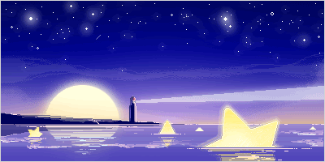
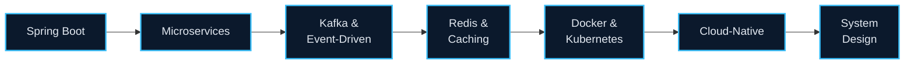
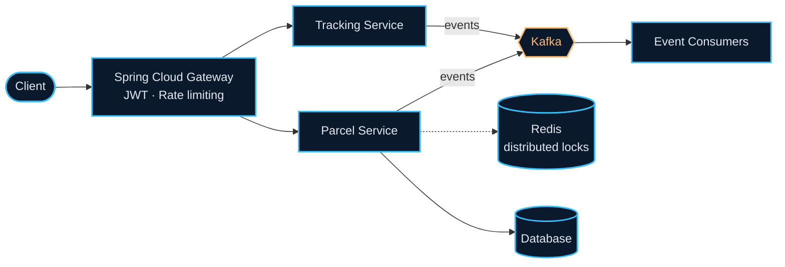

<!-- ======================================================== -->
<!-- 🌊 SPLIT HERO HEADER (BALANCED 2-COLUMN)                  -->
<!-- ======================================================== -->

<table width="100%">
  <tr>
    <td width="56%" valign="middle">
      <div align="left">
        <a href="https://github.com/Khanhnv26">
          
        </a>
        <br/>
        <p>
          <sub>🌊 Crafting high-throughput microservices, event streaming & cloud architectures.</sub>
        </p>
        <p>
          
          
          
        </p>
      </div>
    </td>
    <td width="44%" align="center" valign="middle">
      
    </td>
  </tr>
</table>

<br/>

<!-- ======================================================== -->
<!-- 💻 TERMINAL PROFILE MOCKUP                               -->
<!-- ======================================================== -->

> 🔴 🟡 🟢 **khanh@ocean-cluster-01:~$** `cat dev_profile.json`

```json
{
  "focus": "Distributed Systems · Event-Driven Microservices · Cloud-Native",
  "stack": ["Java 21", "Spring Boot", "Kafka", "Redis", "Docker", "C++"],
  "engineering_mindset": "Scale with simplicity, decouple with events, fail gracefully.",
  "status": "Ready to build resilient systems 🚀"
}
```


<!-- ======================================================== -->
<!-- 👨‍💻 ABOUT ME                                             -->
<!-- ======================================================== -->

<h2 align="center">👨‍💻 About Me</h2>

<table width="100%">
  <tr>
    <td width="58%" valign="top">
      <ul>
        <li>🎓 Final-year Software Engineering student at <b>FPT University Hanoi</b></li>
        <li>💼 <b>Java Backend Developer Intern</b> at <b>VNPT Cloud</b></li>
        <li>🚀 <b>Focus:</b> high-throughput, low-latency distributed systems, Spring Boot microservices, Kafka event streaming, database indexing</li>
        <li>⚡ <b>C++</b> for embedded IoT, automated sensor systems and competitive problem solving</li>
        <li>🤖 <b>AI tooling:</b> Spring AI, LLM APIs, local deployment via Ollama / vLLM</li>
      </ul>
    </td>
    <td width="42%" valign="top">
      <table width="100%">
        <tr><th colspan="2" align="center">⚡ Quick Snapshot</th></tr>
        <tr><td>🔭 <b>Building</b></td><td>Mini Waybill Platform @ VNPT Cloud</td></tr>
        <tr><td>🌱 <b>Exploring</b></td><td>Spring AI · Ollama · vLLM</td></tr>
        <tr><td>🎯 <b>Open to</b></td><td>Backend / Distributed Systems roles</td></tr>
        <tr><td>📫 <b>Reach me</b></td><td><a href="mailto:vankhanhak54@gmail.com">vankhanhak54@gmail.com</a></td></tr>
      </table>
    </td>
  </tr>
</table>

<details>
  <summary><b>🧠 Learning roadmap (click to expand)</b></summary>
  <br/>



</details>


<!-- ======================================================== -->
<!-- 🛠 TECH STACK                                           -->
<!-- ======================================================== -->

<h2 align="center">🛠 Tech Stack</h2>

<table width="100%">
  <tr>
    <td width="26%"><b>Languages</b></td>
    <td></td>
  </tr>
  <tr>
    <td><b>Backend</b></td>
    <td></td>
  </tr>
  <tr>
    <td><b>Messaging & Caching</b></td>
    <td></td>
  </tr>
  <tr>
    <td><b>Databases</b></td>
    <td></td>
  </tr>
  <tr>
    <td><b>DevOps & Tools</b></td>
    <td></td>
  </tr>
  <tr>
    <td><b>AI & LLM</b></td>
    <td>
      
      
      
    </td>
  </tr>
</table>


<!-- ======================================================== -->
<!-- 📌 FEATURED PROJECTS                                    -->
<!-- ======================================================== -->

<h2 align="center">📌 Featured Projects</h2>

<table width="100%">
  <tr>
    <td width="50%" valign="top">
      <h3>🚚 <a href="https://github.com/Khanhnv26/Mini-Waybill-Platform---VNPT-Cloud">Mini Waybill Platform</a></h3>
      <sub>Distributed logistics platform for parcel lifecycle and tracking.</sub>
      <p>
        
        
        
        
        
        
      </p>
      <ul>
        <li>Spring Cloud Gateway with JWT auth & rate limiting</li>
        <li>Kafka event bus with Redis distributed locks</li>
        <li>Spring AI integration for application-level AI features</li>
      </ul>
    </td>
    <td width="50%" valign="top">
      <h3>⚙️ <a href="https://github.com/Khanhnv26/SWP391-QuanLyMayPhatDien-G1">Generator Management System</a></h3>
      <sub>Team project (SWP391) · ERP and asset lifecycle management.</sub>
      <p>
        
        
        
        
      </p>
      <ul>
        <li>Role-based access control (RBAC) via Servlet Filters</li>
        <li>Activity audit logging for key operations</li>
        <li>Batch Excel import / export</li>
      </ul>
    </td>
  </tr>
  <tr>
    <td width="50%" valign="top">
      <h3>🅿️ <a href="https://github.com/Khanhnv26/SmarkParkingIOT">Smart Parking IoT</a></h3>
      <sub>Smart parking automation and fire safety system.</sub>
      <p>
        
        
        
        
      </p>
      <ul>
        <li>Sensor-based vehicle detection and space monitoring</li>
        <li>Low-latency hardware-to-cloud communication</li>
        <li>Real-time event alerts</li>
      </ul>
    </td>
    <td width="50%" valign="top">
      <h3>🛒 <a href="https://github.com/Khanhnv26/StarHubWeb">StarHub Web</a></h3>
      <sub>Tech gadgets e-commerce platform.</sub>
      <p>
        
        
        
        
      </p>
      <ul>
        <li>Inventory tracking and secure order checkout</li>
        <li>Multi-tier service architecture</li>
        <li>Relational schema optimization</li>
      </ul>
    </td>
  </tr>
</table>

<details>
  <summary><b>🏗 Mini Waybill Platform – simplified architecture (click to expand)</b></summary>
  <br/>



</details>


<!-- ======================================================== -->
<!-- 🧩 COMPETITIVE PROGRAMMING & CODING METRICS              -->
<!-- ======================================================== -->

<h2 align="center">🧩 Problem Solving & Coding Activity</h2>

<table width="100%">
  <tr>
    <!-- LeetCode Stats Card (KhanhLiteraturez) -->
    <td width="50%" align="center" valign="middle">
      <a href="https://leetcode.com/u/KhanhLiteraturez/">
        
      </a>
    </td>
    <!-- WakaTime Stats Card (thay đổi Khanhnv26 và đảm bảo profile wakatime.com ở chế độ public) -->
    <td width="50%" align="center" valign="middle">
      
    </td>
  </tr>
</table>


<!-- ======================================================== -->
<!-- 📊 GITHUB PERFORMANCE & ACHIEVEMENTS                     -->
<!-- ======================================================== -->

<h2 align="center">📊 GitHub Metrics & Achievements</h2>

<div align="center">
  
</div>

<br/>

<table width="100%">
  <tr>
    <td width="50%" align="center">
      
    </td>
    <td width="50%" align="center">
      
    </td>
  </tr>
  <tr>
    <td colspan="2" align="center">
      
    </td>
  </tr>
</table>

<br/>

<div align="center">
  <picture>
    <source media="(prefers-color-scheme: dark)" srcset="https://raw.githubusercontent.com/Khanhnv26/Khanhnv26/output/github-contribution-grid-snake-dark.svg"/>
    <source media="(prefers-color-scheme: light)" srcset="https://raw.githubusercontent.com/Khanhnv26/Khanhnv26/output/github-contribution-grid-snake.svg"/>
    
  </picture>
</div>


<!-- ======================================================== -->
<!-- 🎧 SPOTIFY CODING VIBES & CONNECT                        -->
<!-- ======================================================== -->

<div align="center">
  <table width="100%">
    <tr>
      <td align="center" width="20%">
        
      </td>
      <td width="80%">
        🎵 <b>Coding Soundtrack:</b> <a href="https://open.spotify.com/playlist/37i9dQZF1DXdLEN7aqioXM" target="_blank"><b>Deep Work & Ocean Ambient Lofi</b></a> 🎧
        <br/>
        <sub>▶ ━━━━━━━●────────── 02:45 / 04:20 &nbsp; · &nbsp; <i>Low-latency focus & distributed thoughts</i></sub>
      </td>
    </tr>
  </table>
</div>

<br/>

<div align="center">
  <h2>🤝 Connect With Me</h2>
  <a href="mailto:vankhanhak54@gmail.com">
    
  </a>
  <a href="https://github.com/Khanhnv26">
    
  </a>
  <br/><br/>
  
</div>

<div align="center">
  
</div>
