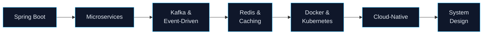

  

  

 

  
  
  

 

<h2 align="center">👨‍💻 About Me</h2>

<table width="100%">
  <tr>
    <td width="58%" valign="top">
      <ul>
        <li>🎓 Final-year Software Engineering student at <b>FPT University Hanoi</b></li>
        <li>💼 <b>Java Backend Developer Intern</b> at <b>VNPT Cloud</b></li>
        <li>🚀 <b>Focus:</b> high-throughput, low-latency distributed systems, Spring Boot microservices, Kafka event streaming, database indexing</li>
        <li>⚡ <b>C++</b> for embedded IoT, automated sensor systems and competitive problem solving</li>
        <li>🤖 <b>AI tooling:</b> Spring AI, LLM APIs, local deployment via Ollama / vLLM</li>
      </ul>
    </td>
    <td width="42%" valign="top">
      <table width="100%">
        <tr><th colspan="2" align="center">⚡ Currently</th></tr>
        <tr><td>🔭 <b>Building</b></td><td>Mini Waybill Platform @ VNPT Cloud</td></tr>
        <tr><td>🌱 <b>Exploring</b></td><td>Spring AI · Ollama · vLLM</td></tr>
        <tr><td>🎯 <b>Open to</b></td><td>Backend / Distributed Systems roles</td></tr>
        <tr><td>📫 <b>Reach me</b></td><td><a href="mailto:vankhanhak54@gmail.com">vankhanhak54@gmail.com</a></td></tr>
      </table>
    </td>
  </tr>
</table>

  
<b>🧠 Learning roadmap (click to expand)</b>

   

<h2 align="center">🛠 Tech Stack</h2>

<table width="100%">
  <tr>
    <td width="26%"><b>Languages</b></td>
    <td></td>
  </tr>
  <tr>
    <td><b>Backend</b></td>
    <td></td>
  </tr>
  <tr>
    <td><b>Messaging & Caching</b></td>
    <td></td>
  </tr>
  <tr>
    <td><b>Databases</b></td>
    <td></td>
  </tr>
  <tr>
    <td><b>DevOps & Tools</b></td>
    <td></td>
  </tr>
  <tr>
    <td><b>AI & LLM</b></td>
    <td>
      
      
      
    </td>
  </tr>
</table>

<h2 align="center">📌 Featured Projects</h2>

<table width="100%">
  <tr>
    <td width="50%" valign="top">
      <h3>🚚 <a href="https://github.com/Khanhnv26/Mini-Waybill-Platform---VNPT-Cloud">Mini Waybill Platform</a></h3>
      Distributed logistics platform for parcel lifecycle and tracking.
      

        
        
        
        
        
        
      

      <ul>
        <li>Spring Cloud Gateway with JWT auth & rate limiting</li>
        <li>Kafka event bus with Redis distributed locks</li>
        <li>Spring AI integration for application-level AI features</li>
      </ul>
    </td>
    <td width="50%" valign="top">
      <h3>⚙️ <a href="https://github.com/Khanhnv26/SWP391-QuanLyMayPhatDien-G1">Generator Management System</a></h3>
      Team project (SWP391) · ERP and asset lifecycle management.
      

        
        
        
        
      

      <ul>
        <li>Role-based access control (RBAC) via Servlet Filters</li>
        <li>Activity audit logging for key operations</li>
        <li>Batch Excel import / export</li>
      </ul>
    </td>
  </tr>
  <tr>
    <td width="50%" valign="top">
      <h3>🅿️ <a href="https://github.com/Khanhnv26/SmarkParkingIOT">Smart Parking IoT</a></h3>
      Smart parking automation and fire safety system.
      

        
        
        
        
      

      <ul>
        <li>Sensor-based vehicle detection and space monitoring</li>
        <li>Low-latency hardware-to-cloud communication</li>
        <li>Real-time event alerts</li>
      </ul>
    </td>
    <td width="50%" valign="top">
      <h3>🛒 <a href="https://github.com/Khanhnv26/StarHubWeb">StarHub Web</a></h3>
      Tech gadgets e-commerce platform.
      

        
        
        
        
      

      <ul>
        <li>Inventory tracking and secure order checkout</li>
        <li>Multi-tier service architecture</li>
        <li>Relational schema optimization</li>
      </ul>
    </td>
  </tr>
</table>

  
<b>🏗 Mini Waybill Platform – simplified architecture (click to expand)</b>

   

<h2 align="center">📊 GitHub Metrics</h2>

<table width="100%">
  <tr>
    <td width="50%" align="center">
      
    </td>
    <td width="50%" align="center">
      
    </td>
  </tr>
  <tr>
    <td colspan="2" align="center">
      
    </td>
  </tr>
</table>

 

  <picture>
    <source media="(prefers-color-scheme: dark)" srcset="https://raw.githubusercontent.com/Khanhnv26/Khanhnv26/output/github-contribution-grid-snake-dark.svg"/>
    <source media="(prefers-color-scheme: light)" srcset="https://raw.githubusercontent.com/Khanhnv26/Khanhnv26/output/github-contribution-grid-snake.svg"/>
    
  </picture>

 

  <h2>🤝 Connect With Me</h2>
  
  
    
  

  

