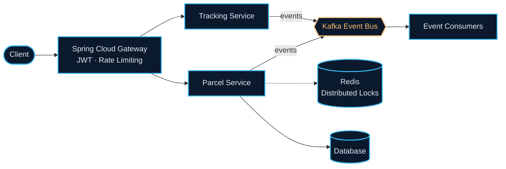

<!-- ======================================================== -->
<!-- 🌊 HERO BANNER & IDENTITY                                -->
<!-- ======================================================== -->

  

    

  <h1>Nguyen Van Khanh</h1>
  
<b>Java Backend Engineer &middot; Distributed Systems &middot; Cloud-Native</b>

  

    Final-year Software Engineering student @ <b>FPT University Hanoi</b> &middot; Backend Intern @ <b>VNPT Cloud</b>
  

  

    
    
    
    
    
  

<!-- ======================================================== -->
<!-- ⚡ CORE ENGINEERING FOCUS                                 -->
<!-- ======================================================== -->

## ⚡ Core Engineering Focus

Tập trung thiết kế và tối ưu **hệ thống phân tán có độ trễ thấp, thông lượng cao**. Kiến trúc các dịch vụ vi mô (Microservices) chịu tải tốt với **Spring Boot 3**, ứng dụng **Apache Kafka** cho mô hình Event-Driven, sử dụng **Redis distributed locks** để kiểm soát tranh chấp đồng thời và bảo đảm tính nhất quán của dữ liệu. Ngoài ra là khả năng lập trình phần cứng IoT và giải thuật tối ưu với **C++**.

<!-- ======================================================== -->
<!-- 🛠 TECH STACK & TOOLING                                   -->
<!-- ======================================================== -->

## 🛠 Tech Stack & Tooling

<table width="100%">
  <tr>
    <td width="50%" valign="top">
      <b>Backend & Distributed Systems</b> 
      Java 21 &middot; Spring Boot 3 &middot; Spring Cloud &middot; Hibernate &middot; Apache Kafka &middot; Redis &middot; C++
    </td>
    <td width="50%" valign="top">
      <b>Infrastructure & Databases</b> 
      Docker &middot; Kubernetes &middot; PostgreSQL &middot; MySQL &middot; SQL Server &middot; Git &middot; Linux
    </td>
  </tr>
</table>

   
  

 

<!-- ======================================================== -->
<!-- 🚀 FEATURED SYSTEMS & ARCHITECTURE                        -->
<!-- ======================================================== -->

## 🚀 Featured Systems

### ⭐ [Mini Waybill Platform](https://github.com/Khanhnv26/Mini-Waybill-Platform---VNPT-Cloud) (VNPT Cloud)
> *Nền tảng logistics & theo dõi vòng đời bưu kiện phân tán theo kiến trúc Microservices.*

* 🛡️ **Spring Cloud Gateway**: Xác thực tập trung với JWT, phân quyền RBAC và rate-limiting chống nghẽn dịch vụ.
* 🛰️ **Apache Kafka Event Bus**: Xử lý luồng sự kiện trạng thái đơn hàng bất đồng bộ giữa các microservices.
* 🔒 **Redis Distributed Locks**: Cơ chế khóa phân tán ngăn chặn triệt để race condition khi cập nhật vận đơn đồng thời.

 

<table width="100%">
  <tr>
    <td width="50%" valign="top">
      <h3>🅿️ <a href="https://github.com/Khanhnv26/SmarkParkingIOT">Smart Parking IoT</a></h3>
      Hệ thống đỗ xe tự động, phát hiện không gian trống và cảnh báo cháy nổ độ trễ thấp từ cảm biến lên Cloud.
      

        
        
        
      

    </td>
    <td width="50%" valign="top">
      <h3>⚙️ <a href="https://github.com/Khanhnv26/SWP391-QuanLyMayPhatDien-G1">Generator Management</a></h3>
      Hệ thống ERP quản lý tài sản máy phát điện (SWP391), bảo mật RBAC qua Servlet Filters và xử lý batch Excel.
      

        
        
        
      

    </td>
  </tr>
</table>

<!-- ======================================================== -->
<!-- 📊 ENGINEERING PROOF & ACTIVITY                           -->
<!-- ======================================================== -->

## 📊 Engineering Activity & Proof of Work

<!-- GitHub Trophy Ribbon -->

  

 

<table width="100%">
  <tr>
    <td width="50%" align="center" valign="middle">
      
    </td>
    <td width="50%" align="center" valign="middle">
      
    </td>
  </tr>
</table>

 

<!-- Contribution Snake Animation -->

  <picture>
    <source media="(prefers-color-scheme: dark)" srcset="https://raw.githubusercontent.com/Khanhnv26/Khanhnv26/output/github-contribution-grid-snake-dark.svg"/>
    <source media="(prefers-color-scheme: light)" srcset="https://raw.githubusercontent.com/Khanhnv26/Khanhnv26/output/github-contribution-grid-snake.svg"/>
    
  </picture>

 

<!-- ======================================================== -->
<!-- 🤝 FOOTER                                                -->
<!-- ======================================================== -->

  

    Designed with minimalism &bull; Built for high concurrency &bull; &copy; 2026 Nguyen Van Khanh
  

