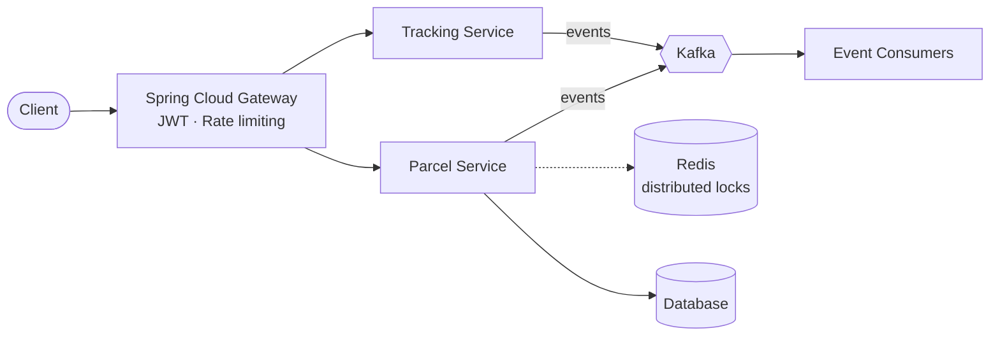

  

  

 

  
  
  
  

 

<h2 align="center">👨‍💻 About Me</h2>

<table align="center" width="100%">
  <tr>
    <td width="60%" valign="top">
      <ul>
        <li>🎓 Final-year Software Engineering student at <b>FPT University Hanoi</b> GPA: 3.6/4.0 (8.88/10) · 100% Scholarship recipient</li>
        <li>💼 <b>Java Backend Developer Intern</b> at <b>VNPT Cloud</b></li>
        <li>🚀 <b>Focus:</b> high-throughput, low-latency distributed systems, Spring Boot microservices, Kafka event streaming and database indexing</li>
        <li>⚡ <b>C++</b> for embedded IoT, automated sensor systems and competitive problem solving</li>
        <li>🤖 <b>AI tooling:</b> Spring AI, LLM APIs, local deployment via Ollama / vLLM to speed up dev workflows and customer automation</li>
      </ul>
    </td>
    <td width="40%" valign="top">
      <table width="100%">
        <tr><th colspan="2" align="center">⚡ Currently</th></tr>
        <tr><td>🔭 <b>Building</b></td><td>Mini Waybill Platform @ VNPT Cloud</td></tr>
        <tr><td>🌱 <b>Exploring</b></td><td>Spring AI · Kafka Streams · Ollama / vLLM</td></tr>
        <tr><td>🎯 <b>Open to</b></td><td>Backend / Distributed Systems roles</td></tr>
        <tr><td>📫 <b>Reach me</b></td><td><a href="mailto:vankhanhak54@gmail.com">vankhanhak54@gmail.com</a></td></tr>
      </table>
    </td>
  </tr>
</table>

<h2 align="center">🛠 Tech Stack & Tools</h2>

  
<strong>Languages & Core</strong>

  
    
  
<strong>Backend, Frameworks & Distributed Systems</strong>

  
    
  
<strong>DevOps, Cloud & Tooling</strong>

  
    
  
<strong>AI & LLM</strong>

  
  
  
  

 

<h2 align="center">📌 Pinned Projects</h2>

<table width="100%">
  <tr>
    <td width="50%" valign="top">
      
      
        <b>Java 21 · Spring Boot · Spring Cloud · Kafka · Redis · Docker · K8s · Spring AI</b> 
        • Distributed logistics platform handling parcel lifecycles and tracking 
        • Spring Cloud Gateway with JWT auth & rate limiting 
        • Kafka event bus with Redis distributed locks
      
    </td>
    <td width="50%" valign="top">
      
      
        <b>Java Servlet · Filter · jBcrypt · MySQL · Apache POI</b> 
        • Generator ERP and asset lifecycle management system 
        • Role-based access control (RBAC) and activity audit logging 
        • Batch Excel import / export
      
    </td>
  </tr>
  <tr>
    <td width="50%" valign="top">
      
      
        <b>C++ · ESP32 · Sensors · IoT Cloud · Java Integration</b> 
        • Smart parking automation and fire safety system 
        • Low-latency hardware-to-cloud communication and real-time alerts
      
    </td>
    <td width="50%" valign="top">
      
      
        <b>Java · Spring Boot · SQL Server · RESTful APIs</b> 
        • Tech gadgets e-commerce with inventory tracking and secure checkout 
        • Multi-tier service architecture and relational schema optimization
      
    </td>
  </tr>
</table>

  
<b>🏗 Click to view: Mini Waybill Platform – simplified architecture</b>

   

<h2 align="center">🐍 Contribution Activity</h2>

  <picture>
    <source media="(prefers-color-scheme: dark)" srcset="https://raw.githubusercontent.com/Khanhnv26/Khanhnv26/output/github-contribution-grid-snake-dark.svg"/>
    <source media="(prefers-color-scheme: light)" srcset="https://raw.githubusercontent.com/Khanhnv26/Khanhnv26/output/github-contribution-grid-snake.svg"/>
    
  </picture>

 

<h2 align="center">📊 GitHub Metrics</h2>

  
  

  
  

 

  

 

  <h2>🤝 Connect With Me</h2>
  
  
    
  

  

